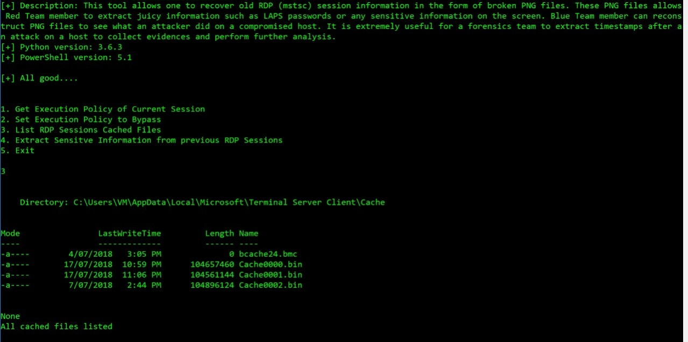

# Remote-Desktop-Caching-
This tool allows one to recover old RDP (mstsc) session information in the form of broken PNG files. These PNG files allows Red Team member to extract juicy information such as LAPS passwords or any sensitive information on the screen. Blue Team member can reconstruct PNG files to see what an attacker did on a compromised host. It is extremely useful for a forensics team to extract timestamps after an attack on a host to collect evidences and perform further analysis.

# Screenshots
On the first run of the `Remote-Desktop-Caching` using `python.exe remotecache.py` user will get options as below:

Using `Option 1` and `Option 2` user can know the current session execution policy and set it to `Bypass` which executes the `rdpcache.ps1` PowerShell script. USing `Option 3` user can list the cached binary files which is going to be used to reconstruct PNG files.

Choosing `Option 4`: Starts analyzing cache files and reconstruction process. This option creates a folder in user C drive with a name of `Recovered_RDP_Sessions`

Sensitive information is recovered from these binary files in the form of broken PNG images. Managed to recover `LAPS password`, `Attacker IP address` and `malicious file names`. It also reveals some of the crucial information about attacker activities on a compromised host. For forensics team `timestamp` is revealed in most of these recovered images. 

# How do I use this?
<pre>
- git clone https://github.com/Viralmaniar/Remote-Desktop-Caching-.git
- python.exe remotecache.py
</pre>

# Questions?

Twitter: https://twitter.com/cyber_ginius  
LinkedIn: https://www.linkedin.com/company/ginius-cyber-security-council/

